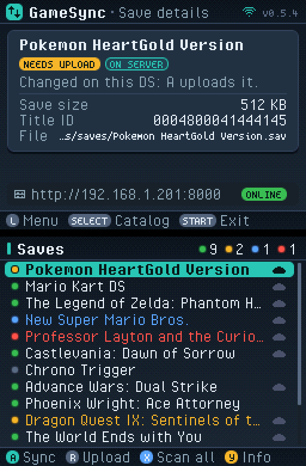
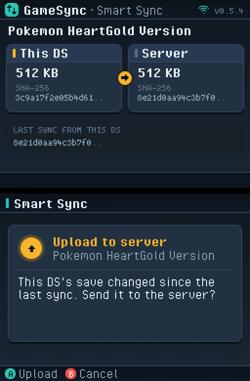
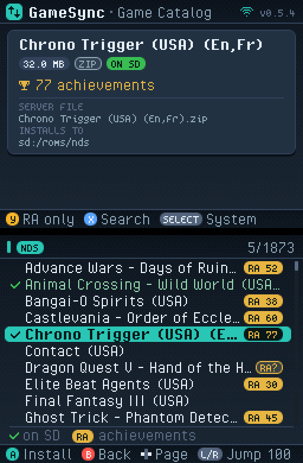

# GameSync — NDS Client

Homebrew client for Nintendo DS / DS Lite / DSi. Syncs save files stored on a flashcard with the GameSync server over WiFi.

Requires a flashcard (e.g. R4, DSTT, Acekard) — saves are read directly from the flashcard filesystem via libfat.

  

## Screens

Both screens are 16-bit bitmaps drawn in software (`source/gfx.c`, `theme.c`, `views.c`): a dark slate theme with a
teal accent, cards, status pills and a footer showing the buttons each screen accepts. The top screen shows details,
the bottom screen the list or dialog you are working in.

The client has three tabs, shown in the top screen's header and switched with **L** / **R** (wrapping around):

- **Saves**: the save list (bottom) with a coloured dot per save (grey = not checked yet, green = up to date,
  amber = needs upload, blue = needs download, red = conflict or check failed) and a cloud for saves the server has.
  The header counts each status after a scan. The top screen shows the selected save: status, what A would do,
  size, title ID, file, and the server address with an online/offline badge.
- **Catalog**: the server's DS games, see [Game catalog](#game-catalog).
- **Settings**: the connection settings and the tools (Rescan Saves, Connect WiFi, Check Updates, Achievement
  Sets, Refresh Catalog) on the bottom screen; the top screen explains the selected entry.

Other screens open on top of a tab and close with **B**:

- **Smart Sync**: this DS's save and the server's side by side on the top screen (size, SHA-256 prefix, last
  sync), the suggested action and its buttons on the bottom.
- **Work in progress** (scan, upload, download, WiFi, updates, achievement sets, game list download): a status card
  with a progress bar where the length is known, over an activity log of everything the client prints, so error
  details stay readable. The result is shown in the same card.
- **Editor**: the D-pad text editor shows the field in a box with the cursor highlighted and a strip of the
  characters Up/Down step through.

The UI can be rendered on a PC, without a DS, for review: `sh ds/tests/render_screens.sh [OUT_DIR]` (needs gcc;
Pillow for PNGs) draws every screen from mock data.

## Requirements

- [devkitPro](https://devkitpro.org/wiki/Getting_Started) with NDS support
- Required package (install via `pacman` inside the devkitPro MSYS2 shell):

```bash
pacman -S nds-dev
```

## Build

**On Windows** — open the devkitPro MSYS2 shell (not Git Bash), then:

```bash
make          # ndssync.nds
make dsi      # ndssync_dsi.nds  (DSi build, faster WiFi)
make both     # both
make clean
```

**On Linux / macOS:**

```bash
make          # ndssync.nds
make dsi      # ndssync_dsi.nds  (DSi build, faster WiFi)
make both     # both
make clean
```

### Host tests

The plain-C parts (catalog JSON parsing and paging, the SD catalog cache, file names, the batched RA set parser)
build and run on a PC:

```bash
# from the repo root, e.g. in a Debian container
docker run --rm -v "$PWD":/src -w /src debian:bookworm-slim sh ds/tests/run_host_tests.sh
# the real http.c + catalog code (and the cache fill / rescan) against this repo's server on a fixture library
docker run --rm -v "$PWD":/src -w /src python:3.12-slim sh ds/tests/run_e2e.sh
```

### Output files

| File | Target |
|---|---|
| `ndssync.nds` | DS / DS Lite, or a DSi running it from a flashcard (DS mode) |
| `ndssync_dsi.nds` | DSi / DSi XL in DSi mode (SD card, TWiLight Menu++ / Unlaunch / hiyaCFW): faster WiFi |

Copy the `.nds` file to the flashcard SD and launch it from the flashcard menu. On a DSi, put `ndssync_dsi.nds`
on the console's SD card and launch it in DSi mode.

### DSi build: faster WiFi

Both builds use the DSi's own WiFi chip (WPA2, firmware access points 4–6) when they run in DSi mode, but the
stock dswifi TCP stack (sgIP) caps every download at one packet per round trip: it never advertises a receive
window above 1400 bytes, and sends no MSS option, so the server falls back to 536-byte segments.

`ndssync_dsi.nds` links a patched copy of dswifi (`third_party/dswifi`, see the notes at the top of
`sgIP_Config.h`) instead of `-ldswifi9`:

- a 64 KB TCP receive buffer and a real receive window (32 KB by default) in DSi mode, so many segments are in
  flight at once
- an MSS option on SYN, so the server sends full-size (1420-byte) segments
- 48 extra 2 KB WiFi packet buffers so a full window has somewhere to land, and the ARM9 at 134 MHz
- `recv()` copies with `memcpy` instead of a byte loop

Started in DS mode (from a flashcard) the same file behaves like the standard build (1400-byte window, plus the MSS
option) and says so when WiFi starts. The window can be tuned in `config.txt`; the catalog's progress screen shows
the resulting KB/s:

```ini
tcp_window=32768   # DSi build only: 1400..65535, default 32768
```

## Configuration

On first launch a default config file is created on the flashcard:

```
fat:/dssync/config.txt
```

Edit it with your server details and WiFi credentials:

```ini
server_url=http://192.168.1.100:8000
api_key=your-secret-key

# WiFi (required for DS / DS Lite — WEP only)
wifi_ssid=YourNetwork
wifi_wep_key=your-wep-key
```

> **DSi note:** The DSi can use firmware WiFi settings; leave `wifi_ssid` and `wifi_wep_key` blank to skip manual WiFi config.

> **WEP only:** The DS WiFi chip only supports WEP encryption. DS Lite has the same limitation. DSi supports WPA via its firmware.

The config can also be edited in-app: go to the **Settings** tab (**L**/**R**) and press **A** on a field. The D-pad
editor: Left/Right move the cursor, Up/Down change the letter under it (or add one at the end; both repeat while
held), **Y** inserts a letter, **X** deletes the one before the cursor, **A** saves, **B** cancels.

## RetroAchievements (DSi + nds-bootstrap-ra)

For playing with achievements on real hardware through the nds-bootstrap-ra fork
(DSi, TWiLight Menu++ on the SD card). The GameSync server talks to
RetroAchievements; it needs `SYNC_RA_USERNAME` and a token from `ra_login.py`.
Run it from the **Settings** tab: **Achievement Sets**, **A**.

- **Achievement Sets**: scans `sd:/roms/nds` recursively (or `sd:/roms` if that doesn't exist; 4 folder
  levels deep, up to 1000 ROMs, `saves` folders skipped) and computes each ROM's RetroAchievements hash first.
  Hashes are cached in `sd:/_nds/ra/hashes.txt` by file name and size, so later runs only download. Then it asks the
  server for the sets in batches (`POST /api/v1/ra/sets`, 32 hashes per request on a DSi, 12 in DS mode) and saves
  the set for every ROM RA knows to `sd:/_nds/ra/sets/<ROM file name>.txt`, where nds-bootstrap loads it. ROMs RA
  doesn't know are skipped. Batching matters: the DSi network stack stops opening connections after a few dozen,
  so one request per ROM used to fail part way through a big library. Hold **B** to stop.

The files go under `sd:/`, or under `fat:/` if only a flashcard with `_nds` is present. nds-bootstrap only runs
achievements from the DSi SD card, though.

## Game catalog

Browse the DS games on the server and install them to the SD card: the **Catalog** tab (**L**/**R**). It works even
when no saves were found.

The bottom screen lists the games; the top screen shows the selected game's full name, size, RetroAchievements
status and whether it is already on the SD. With more than one DS system on the server (`NDS`, `DSI`) the toolbar
shows them as chips and **SELECT** switches.

### Cached game list

The list is kept on the SD so opening the tab doesn't download thousands of games every time, the same way the
MiSTer client does it:

- On the first visit of the tab the client asks the server for its per-system fingerprints
  (`GET /api/v1/roms/fingerprints`) and downloads only a system whose fingerprint changed or that isn't cached yet
  (`GET /api/v1/roms?system=NDS&limit=500&offset=...`, streamed into the cache file page by page; hold **B** to
  stop). An unchanged system opens straight from the SD.
- The cache is one file per system next to the config: `sd:/dssync/cache/NDS.cat` (or `fat:/dssync/cache/` when
  the config lives on the flashcard). The format (`include/catalog_cache.h`) is compact binary records, only the
  fields the DS uses (ROM id, name, file name, size, RA counts, flags), followed by an offset table and a header
  with a format version and the server fingerprint; 3,700 games take about 550 KB. A file from another format
  version is ignored and downloaded again.
- A DS in DS mode has 4 MB of RAM, so the list is never loaded whole: only the offset table (4 bytes a game) is in
  memory and rows are read from the file a screenful at a time. The RetroAchievements filter (**X**) and the search
  (**Y**) run on the DS over the file (same rules as the server: a set with at least one achievement; the text in
  the name or the file name, case ignored).
- Without WiFi, or when the server doesn't answer, the cached list is shown with an **OFFLINE** chip (installing
  needs WiFi). With a cache on the SD the server gets one short try (10 s) before that, instead of the usual retries.
- A server too old to have the fingerprints route gets the old behaviour: nothing is cached, the server pages and
  filters the list (`has_ra`, `search`).
- **Settings > Refresh Catalog** asks the server to rescan its ROM folder (`GET /api/v1/roms/scan`; if that is
  refused or fails it carries on), deletes the cache, downloads every system again and shows the result.

- **RA NN** (gold badge) marks games with a RetroAchievements set of NN achievements. **RA?** (outlined) means the
  server matched the game by name only, so the set may not fit this dump.
- A green **check mark** marks games already on the SD: a `.nds`/`.dsi` file with the same name (extension and case
  ignored) somewhere under the install folder.
- Installing downloads the ROM to `sd:/roms/nds/<name>.nds` (TWiLight Menu++'s folder; `roms/dsi` for DSiWare if
  the server has a `DSI` system). The server keeps DS ROMs zipped and unzips them while sending
  (`?extract=nds`), so the DS writes the plain `.nds` straight to the SD: nothing is held in RAM and nothing is
  unzipped on the DS. The download goes to `<name>.nds.part` first and is renamed when complete. The progress screen
  shows a progress bar, size, percentage, speed (KB/s, current and average) and time left, and the summary shows the
  average WiFi throughput. Free space is checked before writing.
- After installing a game that has achievements, its set is fetched right away (like **Achievement Sets**
  does), so it is ready to play with nds-bootstrap-ra.

Needs a server with `?extract=nds` support on `/api/v1/roms` (older servers are reported as such).

## Controls

The same scheme on every screen (shared by all GameSync console clients): the D-pad moves, **L**/**R** switch tabs,
**SELECT** switches sub-tabs, **A** confirms, **B** cancels or goes back and never starts anything.

| Button | Everywhere |
|---|---|
| Up / Down | Move one row (hold to repeat; wraps around) |
| Left / Right | Page up / down (one screenful; hold to repeat) |
| L / R | Previous / next tab: Saves, Catalog, Settings (wraps around) |
| A | Confirm / the primary action of the selected row |
| B | Cancel, close, go back; during a download or an achievement-set update: hold to stop |
| START | Exit (asks first: A exits, B stays) |

| Screen | A | B | X | Y | SELECT |
|---|---|---|---|---|---|
| Saves | Smart sync of the selected save | - | Scan all saves against the server | Save details | - |
| Catalog | Install the selected game (asks first). After an error: try again | Clear the search | Toggle "only games with RetroAchievements" | Search game names (empty = all) | Next system (NDS / DSI), if the server has both |
| Settings | Edit the field / run the tool | - | - | - | - |
| Smart Sync | Do the suggested upload or download (OK when in sync) | Cancel | Download suggested: upload this DS's save instead. Conflict: upload (keep this DS's save) | Conflict: download (keep the server's) | - |
| Editor | Save | Cancel | Delete the letter before the cursor | Insert a letter | - |
| Install confirm, update, exit dialogs | Yes | No | - | - | - |

In the editor Left/Right move the cursor and Up/Down change the letter instead of moving/paging.
Upload-only (formerly **R** on the save list) is now the **X** choice in Smart Sync when it suggests a download.
